<div align="center">

# 🕹️ JOYSTIQ

**The social network built for gamers.**

Share your best clips, climb the weekly leaderboard, build a 3D avatar, and connect with players who play what you play.


</div>

<div align="center">

### 🎥 See it in action

<a href="https://youtube.com/shorts/ocpU5p7L63w">
  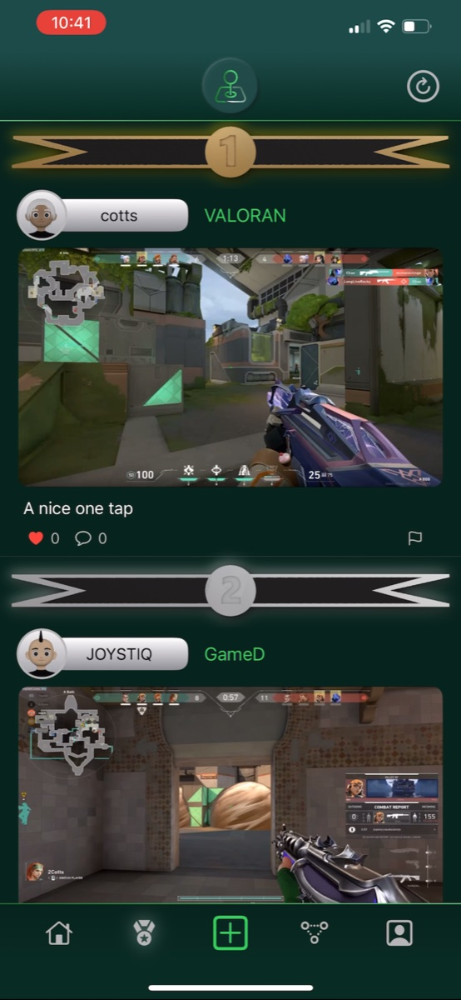
</a>

<a href="https://youtube.com/shorts/ocpU5p7L63w">
  
</a>

</div>

---

## 📖 Table of Contents

- [About](#-about)
- [Screenshots](#-screenshots)
- [Features](#-features)
- [Tech Stack](#-tech-stack)
- [Architecture](#-architecture)
- [Project Structure](#-project-structure)
- [Getting Started](#-getting-started)
- [Configuration](#-configuration)
- [Related Repositories](#-related-repositories)
- [Roadmap](#-roadmap)

---

## 🎮 About

JOYSTIQ is a native iOS social platform designed around the way gamers actually share: short gameplay clips, highlight moments, and the games they love. Every post is tagged with a game, every profile is a personalized 3D game room, and the best clips of the week compete on a global leaderboard.

The app is written entirely in **SwiftUI**, renders fully customizable **3D avatars with SceneKit**, authenticates and stores media with **AWS Amplify (Cognito + S3)**, and talks to a custom **Go + PostgreSQL REST API**.

---

## 📸 Screenshots

### Feeds

<table>
  <tr>
    <td align="center">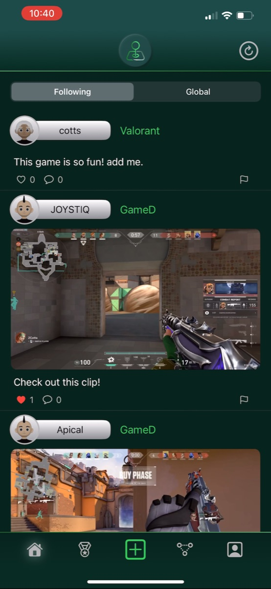</td>
    <td align="center">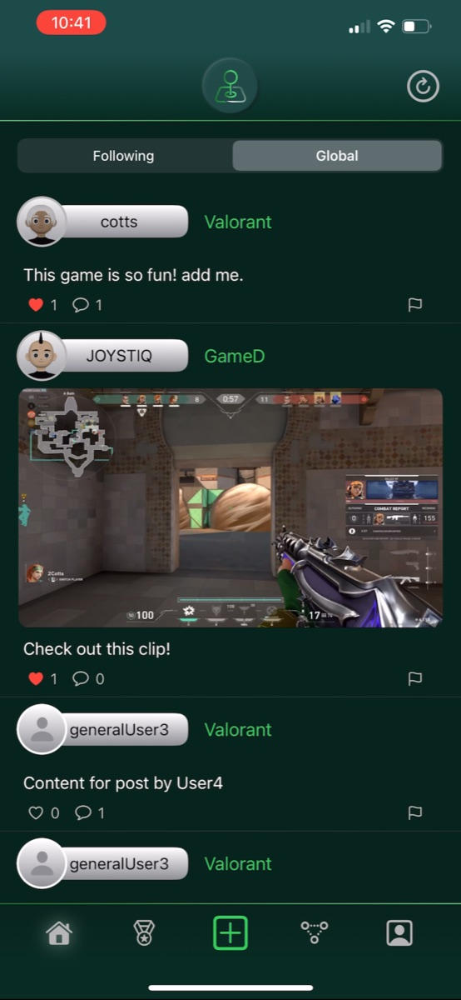</td>
    <td align="center"></td>
  </tr>
  <tr>
    <td align="center"><b>Following Feed</b><br/><sub>Posts from players you follow</sub></td>
    <td align="center"><b>Global Feed</b><br/><sub>Discover clips from everyone</sub></td>
    <td align="center"><b>Weekly Leaderboard</b><br/><sub>Top-liked clips this week</sub></td>
  </tr>
</table>

### Profiles & Avatars

<table>
  <tr>
    <td align="center">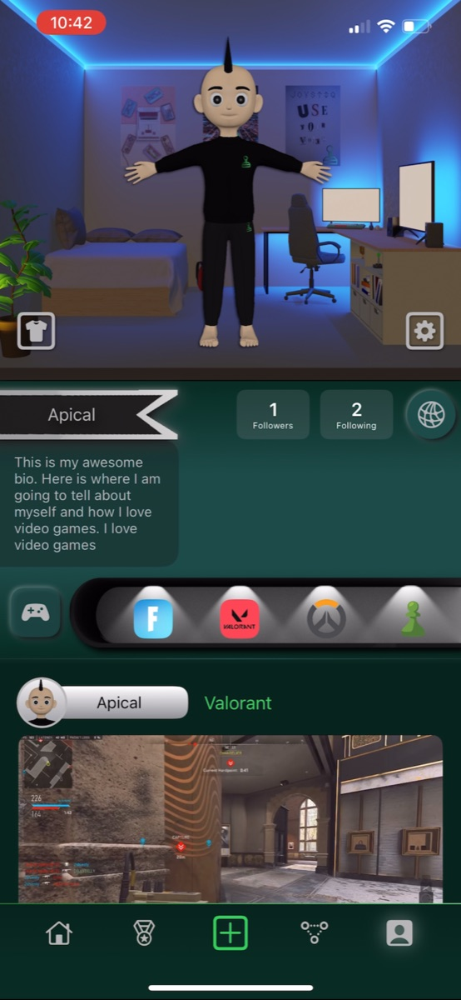</td>
    <td align="center">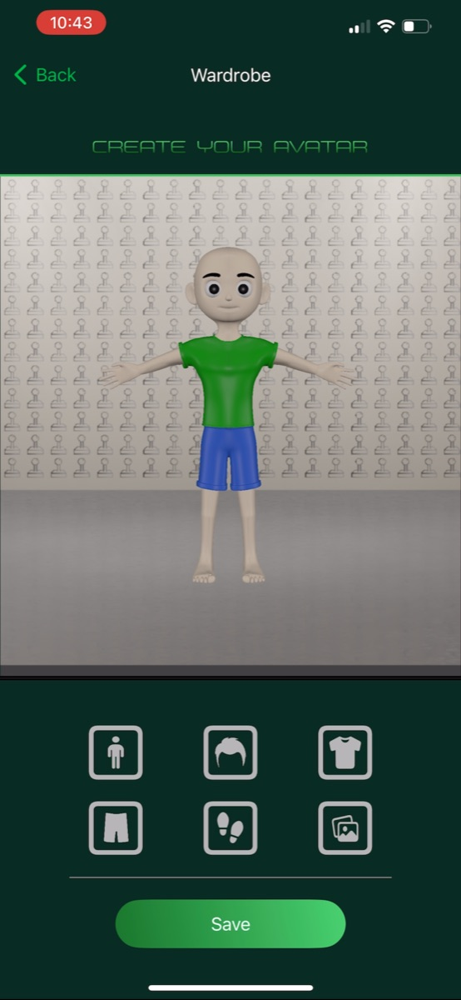</td>
    <td align="center">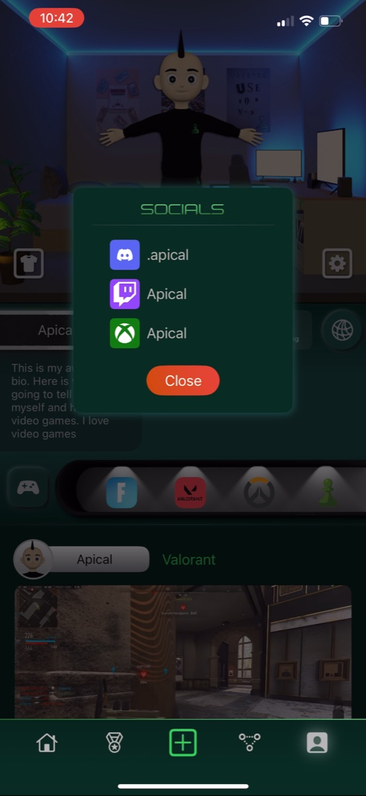</td>
  </tr>
  <tr>
    <td align="center"><b>Your Profile</b><br/><sub>3D game room, bio, games & posts</sub></td>
    <td align="center"><b>Avatar Wardrobe</b><br/><sub>Build your 3D character</sub></td>
    <td align="center"><b>Linked Socials</b><br/><sub>Discord, Twitch, Xbox & more</sub></td>
  </tr>
</table>

### Social

<table>
  <tr>
    <td align="center">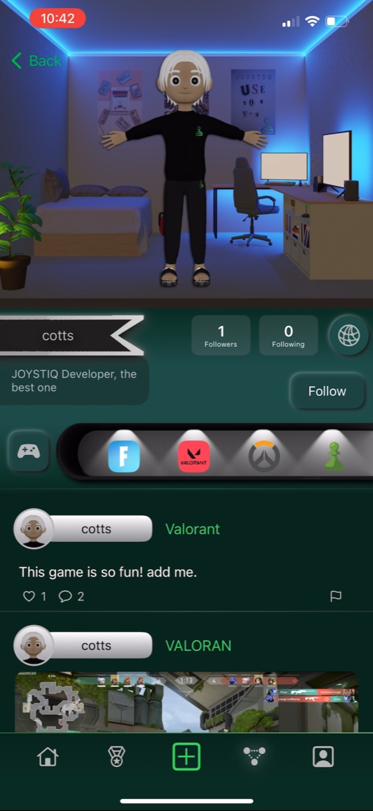</td>
    <td align="center">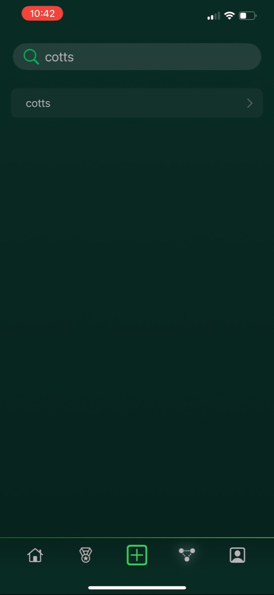</td>
    <td align="center">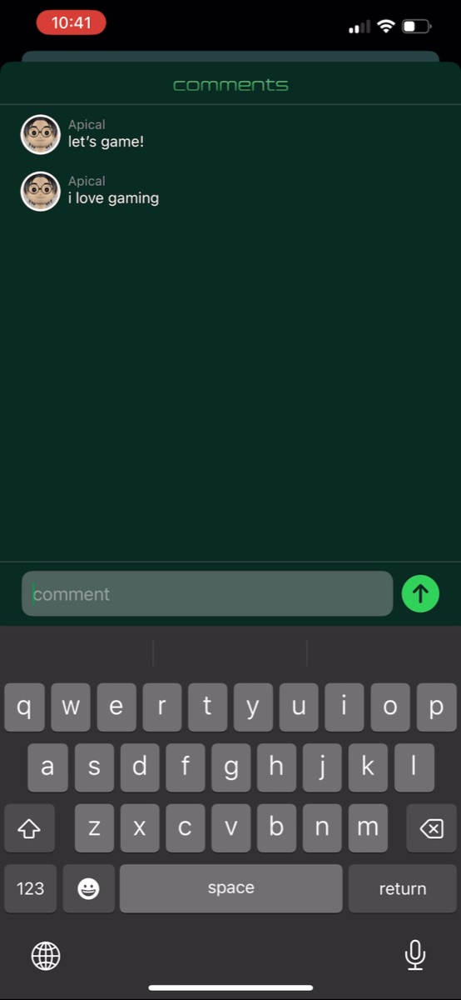</td>
    <td align="center">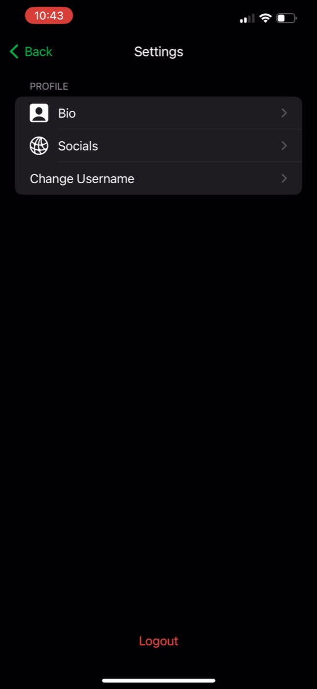</td>
  </tr>
  <tr>
    <td align="center"><b>Player Profiles</b><br/><sub>Follow other gamers</sub></td>
    <td align="center"><b>Search</b><br/><sub>Find players by username</sub></td>
    <td align="center"><b>Comments</b><br/><sub>Talk about the play</sub></td>
    <td align="center"><b>Settings</b><br/><sub>Edit bio, socials & username</sub></td>
  </tr>
</table>

---

## ✨ Features

### 🎬 Clips & Posts
- **Video, photo, and text posts:** upload gameplay clips or screenshots straight from your photo library.
- **Automatic video thumbnails:** a thumbnail is generated on-device with `AVAssetImageGenerator` and uploaded alongside the clip.
- **Game tagging:** tag every post with one of 49 supported games (Valorant, Fortnite, Apex, CS2, Overwatch, Elden Ring, and more), each with its own icon.
- **Inline video playback:** a shared `AVPlayer` manager plays one clip at a time as you scroll, keeping memory and bandwidth low.
- **Edit, delete, and report:** manage your own posts, or flag others' posts for moderation.

### 📰 Feeds
- **Following feed:** a chronological feed of posts from players you follow, plus your own.
- **Global feed:** discover content from the entire community.
- **Infinite scroll:** cursor-based pagination loads new posts as you reach the bottom.
- **Pull to refresh:** pull down, or tap the refresh button, to reload the feed.

### 🏆 Weekly Leaderboard
- Ranks the **top 10 video clips** by likes received since the start of the week.
- Gold, silver, and bronze banners for the podium spots.
- Resets every Sunday, so every week is a new competition.

### 🧍 3D Avatars & Game Rooms
- A fully **3D, SceneKit-rendered avatar** on every profile, built from USD (`.usdc`) models.
- **Wardrobe editor:** customize skin tone, hair, shirt, pants, shoes, and background environment.
- **Environments:** show off your avatar in a neon-lit gamer bedroom or a classic studio backdrop.
- Avatar snapshots appear as profile pictures across feeds, comments, and profile banners.

### 👥 Social
- **Follow and unfollow** other players, with follower and following counts and lists.
- **Likes and comments** on every post, with live counts.
- **Username search** with case-insensitive partial matching.
- **Player profiles** with bio, favorite-games carousel, post history, and a Follow button.
- **Linked socials:** connect Discord, Twitch, Kick, YouTube, Xbox, and PlayStation accounts.

### 🔐 Accounts
- **Email and password sign-up** with email verification codes, powered by AWS Cognito.
- **Forgot and reset password** flows.
- **Username rules and moderation:** usernames are checked for format, availability, and profanity on the server.
- **Profile settings:** edit your bio, socials, and username.
- **In-app feedback:** send feedback directly to the team from the app.

---

## 🛠 Tech Stack

| Layer | Technology |
|---|---|
| **Language** | Swift 5 |
| **UI** | SwiftUI (iOS 16+) |
| **3D Rendering** | SceneKit, USD (`.usdc`) models |
| **Media** | AVKit / AVFoundation (playback and thumbnail generation), `UIImagePickerController` |
| **Authentication** | AWS Amplify, Amazon Cognito (email/password and email verification) |
| **Media Storage** | AWS Amplify Storage, Amazon S3 (clips, images, thumbnails, avatars) |
| **Networking** | `URLSession` REST client with `Codable` models |
| **Backend API** | Go (Fiber), PostgreSQL, Docker ([Backend repo](https://github.com/JOYSTIQ-The-App/Backend)) |
| **Dependencies** | Swift Package Manager: Amplify Swift, AWS SDK for Swift, SDWebImageSwiftUI, SwiftUIX |

---

## 🏗 Architecture

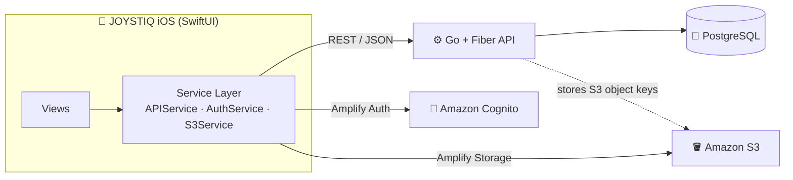

**How data flows:**

1. **Auth:** users sign up and sign in through Cognito via Amplify. The authenticated email identifies the user to the API.
2. **Media:** clips, images, thumbnails, and avatar snapshots are uploaded directly to S3. Only the resulting **S3 object key** is sent to the API and stored in Postgres.
3. **Data:** posts, likes, comments, follows, profiles, and socials go through the Go REST API.
4. **Rendering:** when a feed loads, the app resolves each post's S3 key to a URL with `Amplify.Storage.getURL` and streams the media.

### Protocol-based services

Every service sits behind a protocol, so views are generic over their dependencies and can run against real or mock implementations:

```swift
protocol APIServiceProtocol {
    func getUserFeed(for email: String, lastSeenCreatedAt: String?,
                     completion: @escaping (Result<[Post], Error>) -> Void)
    func createPost(email: String, postData: PostData,
                    completion: @escaping (Result<Void, Error>) -> Void)
    // ...30 endpoints
}

struct AppView<APIServiceType: APIServiceProtocol,
               AuthServiceType: AuthServiceProtocol & ObservableObject>: View { ... }
```

`MockAPIService` and `MockS3Service` supply canned data, so every screen can be built in **SwiftUI Previews** without a network connection or AWS account.

---

## 📂 Project Structure

```
JOYSTIQ/
├── JOYSTIQ.xcodeproj
├── amplify/                     # Amplify backend definitions (Cognito auth, S3 storage)
├── AvatarNodes/                 # 3D avatar parts (.usdc): Hair, Torso, Legs, Footwear + textures
├── AvatarStuff/                 # Additional 3D clothing models
└── JOYSTIQ/
    ├── JOYSTIQApp.swift         # App entry point, Amplify configuration
    ├── Models/                  # Codable models: Post, Comment, User, Profile, Avatar, GameData…
    ├── Services/
    │   ├── APIService.swift     # REST client for the Go backend (+ MockAPIService)
    │   ├── AuthService.swift    # Cognito sign up / sign in / verification / password reset
    │   ├── S3Service.swift      # Media uploads to S3 (+ MockS3Service)
    │   └── FeedbackService.swift
    ├── View/
    │   ├── AppView.swift        # Root tab container and custom nav bar
    │   ├── Auth/                # Login, Sign Up, Confirm, Forgot / Reset Password
    │   ├── HomeTab/             # Following / Global feeds, header, notifications
    │   ├── LeaderboardTab/      # Weekly top-10 leaderboard
    │   ├── CreatePostViews/     # Clip / photo / text post creation, game picker
    │   ├── ConnectTab/          # Player search
    │   ├── PostViews/           # Post cards, likes, comments, interaction menus
    │   └── ProflileTab/         # Profile, other players, followers, settings,
    │       └── AvatarViews/     #   SceneKit avatar + wardrobe editors
    ├── Extensions/              # Neumorphic buttons, hex colors, rounded corners…
    ├── Util/                    # Media picker, AVPlayer manager, screen helpers
    └── Assets.xcassets          # Game icons, social icons, colors, images
```

---

## 🚀 Getting Started

### Prerequisites

| Requirement | Version |
|---|---|
| macOS with **Xcode** | 15+ |
| **iOS** device or simulator | 16.4+ |
| **AWS account** and [Amplify CLI](https://docs.amplify.aws/gen1/swift/start/getting-started/installation/) | `npm i -g @aws-amplify/cli` |
| **JOYSTIQ Backend** | Running locally or on a server ([Backend repo](https://github.com/JOYSTIQ-The-App/Backend)) |

### 1. Clone the repository

```bash
git clone https://github.com/JOYSTIQ-The-App/iOS.git
```

### 2. Start the backend

The app needs the JOYSTIQ Go API and PostgreSQL database. From the [Backend repo](https://github.com/JOYSTIQ-The-App/Backend):

```bash
./start_services.sh
```

This starts Postgres and the API in Docker, with the API listening on port `8080`. See the backend README for seeding dummy data and other setup options.

### 3. Set up AWS Amplify (Cognito + S3)

The `amplify/` folder defines the auth and storage resources. Provision them in your own AWS account:

```bash
cd iOS/JOYSTIQ
amplify init
```

```bash
amplify push
```

This creates the Cognito user pool and S3 bucket, and generates `amplifyconfiguration.json` and `awsconfiguration.json`. Make sure both files are included in the **JOYSTIQ** target in Xcode.

### 4. Point the app at your API

In [`JOYSTIQ/JOYSTIQ/Services/APIService.swift`](JOYSTIQ/JOYSTIQ/Services/APIService.swift), set `baseURL` to your backend:

```swift
class APIService: APIServiceProtocol {
    let baseURL = "http://localhost:8080"   // or your server's address
```

> **Note:** For a non-HTTPS server, add an App Transport Security exception in `Info.plist`, or serve the API over HTTPS.

### 5. Build and run

```bash
open JOYSTIQ/JOYSTIQ.xcodeproj
```

Xcode resolves the Swift Package dependencies automatically. Pick a simulator or device and press **⌘R**.

> 💡 To work on UI without a backend, use **SwiftUI Previews**. The views are generic over `APIServiceProtocol`, so previews use `MockAPIService` with sample data.

---

## ⚙️ Configuration

| Setting | Location |
|---|---|
| API base URL | `Services/APIService.swift` → `baseURL` |
| Amplify / AWS config | `amplifyconfiguration.json`, `awsconfiguration.json` (generated by the Amplify CLI) |
| Supported games and icons | `Models/GameData.swift` and `Assets.xcassets` |
| Bundle identifier | Xcode → JOYSTIQ target → Signing & Capabilities |

### Adding a new game

1. Add an icon to `Assets.xcassets`.
2. Add an entry to `GameData.gamesDictionary`:
   ```swift
   "Rocket League": "rocketleague",
   ```

---

## 🔗 Related Repositories

| Repo | Description |
|---|---|
| **[JOYSTIQ iOS](https://github.com/JOYSTIQ-The-App/iOS)** | This repo: the native SwiftUI app |
| **[JOYSTIQ Backend](https://github.com/JOYSTIQ-The-App/Backend)** | Go (Fiber) REST API, PostgreSQL schema, Docker deployment |

---

## 🗺 Roadmap

- [ ] Achievements and accolades on profiles ("Showcase your achievements!")
- [ ] Gamer resume section
- [ ] Push notifications for likes, comments, and new followers
- [ ] More avatar clothing, hair, and environments
- [ ] Token-based (JWT) API authentication with Cognito
- [ ] Migrate networking to `async/await`

---

<div align="center">

**Built with ❤️ for gamers.**

</div>
